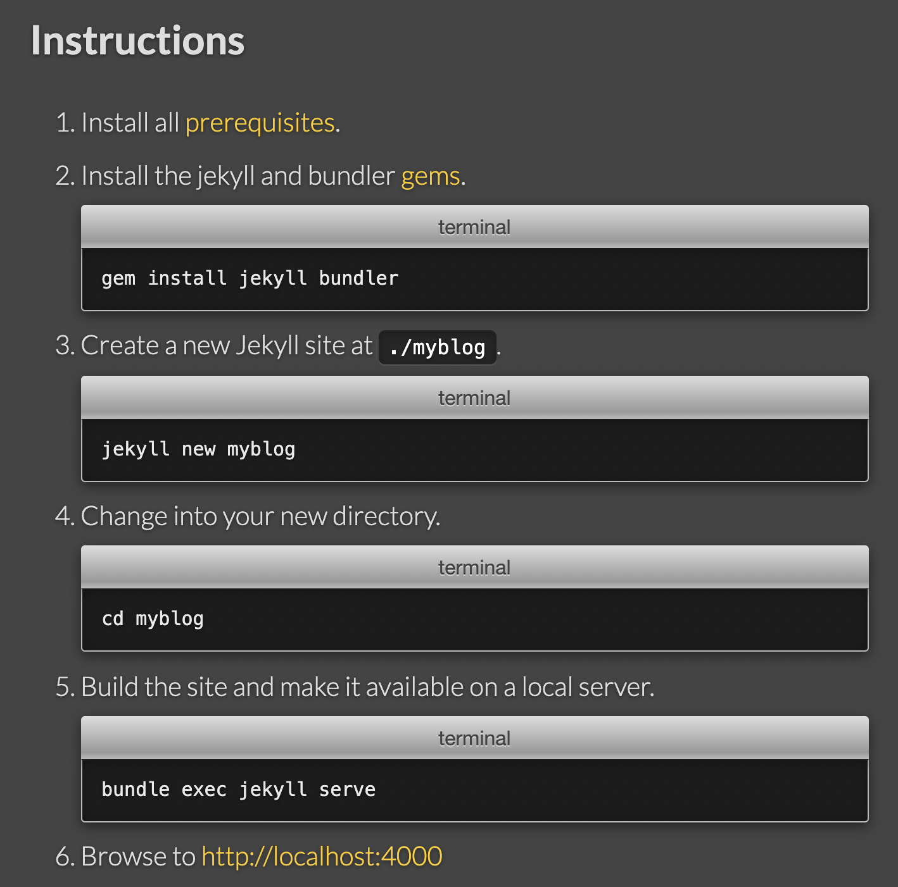

지금까지 포스팅을 하면서,
commit, push 후 몇 초가 지난 후에야 변경된 페이지를 볼 수 있는 번거로움이 있다.


그래서 로컬 PC에서 블로그의 변경 사항을 실시간으로 확인할 수 있는 방법을 사용할 것이다.

이 방법을 진행하기 위해서는 몇가지 설치가 필요하다.

[링크](https://jekyllrb.com/docs/) 에 들어가서 Instructions 를 차례대로 진행하면 된다.




1. 자기 os 환경에 맞는 링크를 클릭하여 Ruby 프로그램을 설치한다. (with devkit, 최신(첫번째) 프로그램 링크 클릭 → 동의 → 3 enter)

2. terminal 또는 cmd 창에서 Jekyll bundler 를 설치한다.

3. 만약 GitPages가 생성된 상태라면 생략.

4. 생성된 [blog_name].github.io 폴더로 이동한다.

5. jekyll serve 

   만약, 'cannot load such file' 에러가 뜨면, ```bundle add webrick ``` 명령어를 입력하고 다시 serve하면 된다.

6. http://localhost:4000 주소로 들어가면 블로그 웹페이지가 실행되는 것을 볼 수 있다.

<br>

이것은 원격에서 구동되는 서버가 아니라 로컬에서 띄어놓은 서버다.

때문에 변경 사항이 있으면 바로바로 반영된다.

