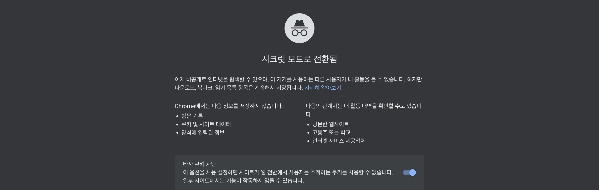

## 개발자 도구로 화면 캡처하기

### 1. Chrome 개발자 도구 열기

```F12``` 또는 ```Option + Cmd + I```

<br/>

### 2. Command 창을 열자

- 단축키 이용

  - Windows : ```Ctrl + Shift + P```

  - macOS : ```Cmd + Shift + P```

- 마우스 이용

  - 

<br/>

### 3. 여러가지 명령어가 있다, 원하는 기능을 검색해서 사용하면 된다.


<br/>

>  Screenshot


<br/>

전체 화면은 아래와 같다.

<br/>

여기서 4가지 캡쳐 방식이 있는데 각각 어떻게 캡쳐되는지 알아보자.

- **Capture area screenshot**: 캡처하고 싶은 영역을 지정하여 캡쳐

  

- **Capture full size screenshot**: html 영역 전체 화면 캡쳐

  

- **Capture node screenshot**: html 태그 영역 캡쳐

  아래는 아이콘 클래스를 캡처한 것이다.

  

- **Capture screenshot**: 보이는 html 영역 화면 캡쳐

  Capture full size screenshot 과 유사하지만 보이는 영역만 캡쳐하는 것을 알 수 있다.

  


<br/>

>  **Capture full size screenshot** vs. **Capture screenshot**

네이버 창을 캡쳐해보면 확연한 차이가 보인다.


